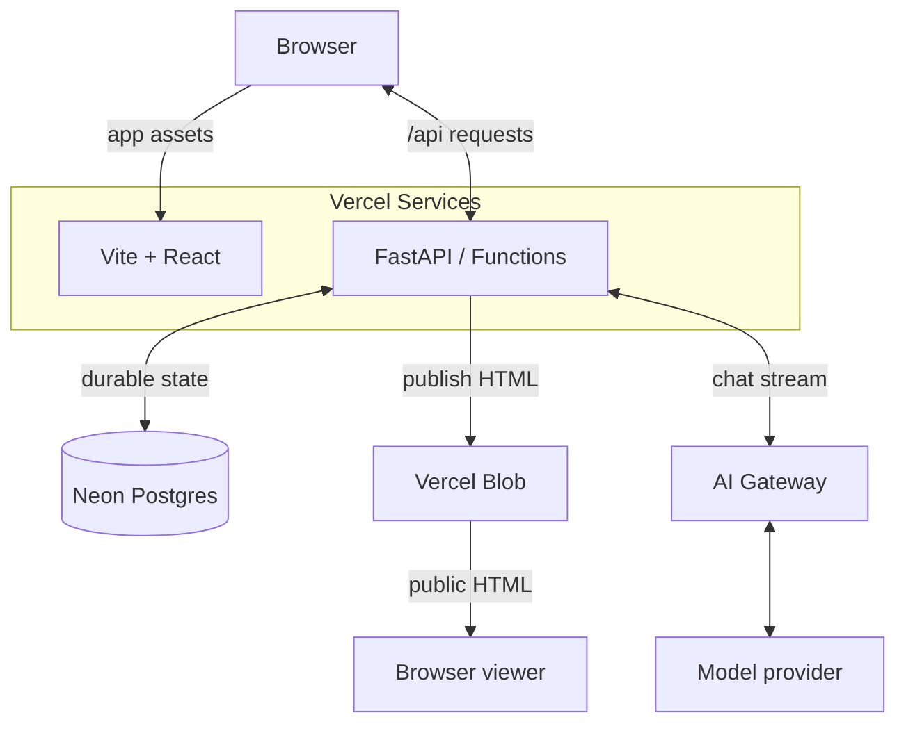
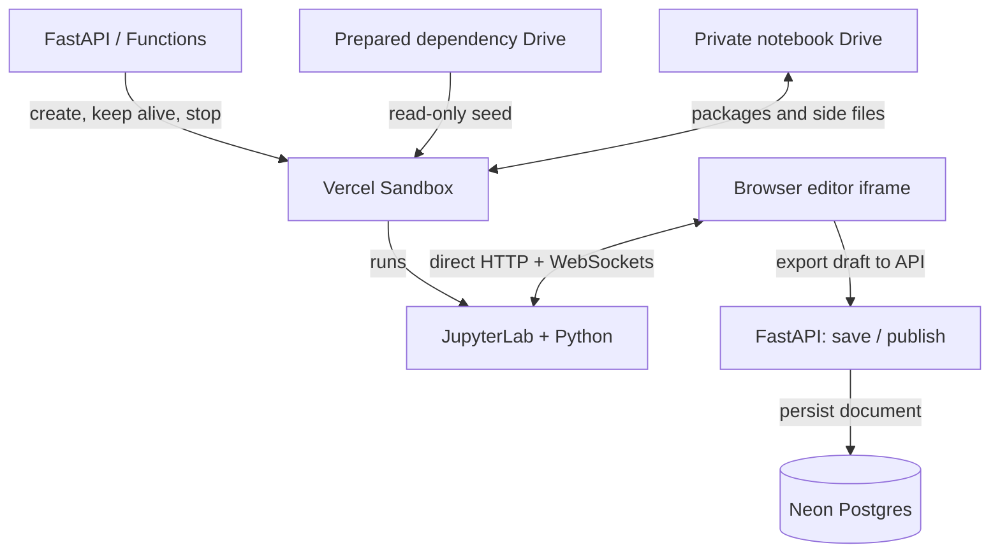

# Notebook Factory

A public Python notebook library with GitHub-owner-only editing. React and FastAPI run as Vercel Services; temporary JupyterLab environments run in Vercel Sandbox.

## Overall architecture on Vercel

Vercel hosts the web and API services, isolates Python execution in Sandbox, serves published artifacts through Blob, and routes model requests through AI Gateway. Neon Postgres holds durable application state.

The application and publication path uses two services in one Vercel deployment. API calls share the app origin; published HTML is fetched directly from Blob. GitHub OAuth authenticates the owner through the API.

Browser and Browser viewer represent the same client, drawn separately to keep the publication path compact. Neon is connected through Vercel Marketplace. The viewer isolates HTML in a sandboxed iframe; reading a publication never starts a Python kernel.

Notebook execution has a separate lifecycle. The API manages the Sandbox, while the embedded editor connects directly to JupyterLab for HTTP and kernel WebSockets.

The two FastAPI nodes represent the same backend service. The dependency drive contains prepared dependencies, including fonts from Blob, but no private notebook data. The API supplies the current draft and editor assets when creating a session. AI cell tools use the browser bridge to operate on this live editor.

| Platform component | Role in this app | Implementation and details |
| --- | --- | --- |
| Vercel Services and Functions | Deploy frontend and backend together under one origin; FastAPI handles authentication, metadata, persistence, publication, and streamed setup/chat responses. | [vercel.json](../vercel.json), [[backend/main.py]], [[architecture#Services]] |
| Vercel Sandbox | Run notebook Python and JupyterLab in one shared non-persistent VM with separate notebook kernels, a durable writable workspace drive, and a read-only dependency drive. The backend injects the current private draft and fresh editor assets. | [[backend/editor.py#start]], [[editing#Prepared dependency environment]] |
| Vercel Blob | Serve immutable published HTML through the CDN and store the prepared font bundle used to build dependency drives. | [[backend/publication.py#upload]], [[deployment#Published HTML in Blob]], [[editing#Plot font fallback]] |
| Vercel AI Gateway and AI SDK | Route configured model inference and stream assistant responses; browser tools apply cell edits and execution through the authenticated Jupyter bridge. | [[backend/chat.py#stream]], [[frontend/src/Chat.tsx#Chat]], [[chat#Live document tools]] |
| Vercel deployment identity | Supply OIDC for backend Sandbox and Gateway access. Blob uses its backend-only read/write token; database and OAuth credentials remain backend configuration. | [[backend/main.py#headers]], [[deployment#Environment configuration]] |
| Neon via Vercel Marketplace | Persist notebook drafts, published source and fallback HTML, chat history, editor session records, and operation leases across requests and deployments. | [[backend/db.py]], [[architecture#Persistence]], [[chat#Persistent conversations]] |

### Main data flows

Public reading, private editing, and AI assistance share the API and database, while notebook execution and artifact delivery use separate Vercel services.

1. **Read:** the browser loads the React app and public notebook metadata, then fetches published HTML directly from Blob into a sandboxed iframe. The API render endpoint supplies a fallback; public viewing does not start a Sandbox or execute cells.
2. **Edit:** GitHub OAuth establishes the owner session. The API acquires a database lease and opens or reuses a Sandbox. The editor iframe connects directly to JupyterLab, including kernel WebSockets. The browser exports its live document through the bridge and sends autosaved private drafts to the API for Postgres persistence.
3. **Publish:** Save & exit exports the document, renders HTML in the backend, uploads it to Blob, and commits the published source, fallback HTML, artifact URL, and revision together in Postgres. Publication does not deploy the app. The notebook kernel shuts down after persistence; the shared VM stays warm.
4. **Assist:** the browser sends an authenticated chat turn to FastAPI, which streams inference through AI Gateway. Notebook tool calls return to the browser and act on the live Jupyter document; rename calls the authenticated API. Private chat history is saved separately in Postgres.

### Deployment and lifetime boundaries

Application deployments, prepared dependencies, live execution sessions, and durable notebook content have independent lifetimes.

[scripts/deploy.sh](../scripts/deploy.sh) prepares immutable font assets and validates or builds the dependency-only drive before deploying both app services. Committed manifests pin these prepared resources; [[deployment#Preparing dependency drives]] describes reuse and rollback requirements.

[[backend/editor.py#generation]] ties editor reuse to the creating deployment so a replacement receives current bridge assets. The shared dependency drive contains no private notebooks or editor tokens. Live Sandboxes are disposable: notebook documents and saved outputs survive in Postgres, while extra installed packages and side files survive on the shared workspace drive. Kernel memory does not persist. See [[editing#Deployment generations]] and [[editing#Closing and recovery]].

Database leases coordinate editor mutations across Function instances. Shutdown and deletion cleanup use response background tasks rather than a durable queue. Public Blob artifacts contain only published content; drafts, chat, and editor capabilities stay behind owner authorization. See [[architecture#Authentication]] and [[architecture#Notebook deletion]].

## Product scope

[[frontend/src/main.tsx]] provides notebook navigation, title search, creation, public rendering, downloads, and an embedded editor for GitHub user 1st1.

The selected notebook is reflected in the `notebook` URL query parameter. Public readers see published content; owner edits remain private until Save & exit. Creation immediately publishes the starter notebook at revision 1. There is no separate unpublished-notebook state.

Titles are set at creation and can be changed through [[chat#Notebook renaming]]. The owner can delete notebooks through [[architecture#Notebook deletion]]. Notebook upload, revision history, and collaborative editing are not implemented. A revision is a counter, not a stored historical snapshot. [[editing]] describes the editor lifecycle.

## Services

[vercel.json](../vercel.json) routes `/api/:path*` to the FastAPI service rooted at `backend` and `/(.*)` to the Vite service rooted at `frontend`.

The API entrypoint is `main:app`, with a 300-second function limit. The catch-all deliberately uses `/(.*)`: the previous `/:path*` form missed the bare root path in production. Deploy the repository root so both services and rewrites are included.

[frontend/package.json](../frontend/package.json) defines React 19, TypeScript, Vite, and Lucide dependencies. [backend/pyproject.toml](../backend/pyproject.toml) defines FastAPI, SQLAlchemy, asyncpg, nbformat, nbconvert, and the Python Sandbox SDK; the lockfiles resolve installed versions. [backend/.python-version](../backend/.python-version) selects Python 3.13.

Browser API calls stay on the app origin. Editor HTTP and WebSocket traffic connects directly to the Sandbox origin; Functions do not proxy kernel WebSockets. Postgres stores durable notebook state. See [[deployment]] for the actual project configuration.

## Persistence

[[backend/db.py]] owns the notebook table and async SQLAlchemy engine. Postgres is required on Vercel; local development defaults to a SQLite file in the backend directory.

| Fields | Meaning |
| --- | --- |
| `id`, `title` | UUID identity and mutable public display title |
| `source` | Latest durable private draft, including saved cell outputs |
| `published` | Notebook document exposed by public render and download endpoints |
| `render_url` | Immutable public Blob URL for rendered HTML; included in notebook metadata |
| `published_html` | Pre-rendered HTML for the same published revision; nullable for legacy rows |
| `created_at`, `updated_at`, `revision` | Creation/publication metadata; draft saves do not change publication time |
| `editor` | Nullable JSON containing shared Sandbox name, unique document path, editor URL, and bridge token |
| `chat_history`, `chat_revision` | Private conversation and optimistic concurrency counter |
| `claim`, `claim_until` | Atomic operation lease shared across function instances |

[[backend/db.py#initialize]] creates missing tables under a Postgres transaction advisory lock. Initialization also adds the nullable published HTML column to existing tables. This targeted upgrade is not a general migration framework. Postgres retains up to two idle connections with three overflow connections, pre-ping checks, and five-minute recycling to avoid repeating connection setup on every request. SQLite tests use NullPool. Application shutdown disposes the pool.

[[backend/config.py]] normalizes conventional Postgres URLs for asyncpg, maps `sslmode` to `ssl`, and removes libpq's `channel_binding` option. Deployment startup rejects missing or non-Postgres database configuration.

[[backend/main.py#editor_lease]] serializes create-editor, save, and close operations with a five-minute database lease. Conflicting operations return 409. Lease release matches the claim token, so one request cannot clear another request’s lease.

## Public rendering

[[backend/render.py#render]] converts notebooks to HTML during creation and publication. Public views fetch published HTML from Blob’s CDN into a sandboxed iframe, without executing cells or running nbconvert. [[backend/render.py#validate]] enforces valid notebook structure and the size limit from [[backend/config.py#MAX_BYTES]].

Lab and base templates are bundled in [backend/templates](../backend/templates), with explicit template search paths. Functions cannot rely on system-installed Jupyter data directories. Public downloads also return `published`, even for the signed-in owner.

The rendered iframe and API response both enforce sandboxing. The CSP blocks network connections and nested frames while permitting selected script CDNs, styles, fonts, and images. Some interactive outputs therefore do not work publicly. HTML conversion runs off the API event loop. Blob upload completes first, then source, fallback HTML, Blob URL, and revision are published in one transaction; rendering failure preserves the prior publication. Legacy rows render once on first read, with a revision-guarded cache write that cannot overwrite a newer publication. Notebook listings select metadata only.

## Authentication

[[backend/auth.py]] uses GitHub OAuth and signed, expiring cookies. [[backend/auth.py#require_owner]] enforces the 1st1 login and exact application Origin on every notebook mutation.

OAuth requests `read:user`. A signed state cookie expires after ten minutes; the signed session expires after seven days. Cookies are HttpOnly, SameSite=Lax, and Secure on HTTPS. The access token is used to fetch identity, not persisted in the session. The session retains GitHub’s avatar URL for the sidebar; older sessions derive the avatar URL from the stored account ID without requiring a new login. The sidebar falls back to the login initial if the image is missing or fails to load.

The owner check is case-insensitive on the GitHub login, not pinned to a numeric account ID. The frontend hides editing controls for other users, while the backend independently rejects unauthorized requests. There is no development authentication bypass.

Public notebook metadata excludes drafts, editor capabilities, and leases. Responses use no-store caching and no-referrer headers. Logout requires the configured Origin, and the UI disables logout while an editor is open.

## API contracts

[[backend/main.py]] exposes public reads and owner-only mutations. [[backend/auth.py]] provides identity, OAuth login/callback, and logout routes.

| Route | Contract |
| --- | --- |
| `GET /api/notebooks` | Public metadata ordered by publication update time |
| `POST /api/notebooks` | Owner creates a starter notebook from a nonblank title, returning 201 |
| `GET /api/notebooks/{id}/render` | Published HTML with isolation headers |
| `GET /api/notebooks/{id}/download` | Published `.ipynb` attachment |
| `POST /api/notebooks/{id}/editor` | Owner opens/reuses an editor; JSON or event stream depending on Accept |
| `POST /api/notebooks/{id}/save` | Validates session token, persists draft, optionally publishes |
| `POST /api/notebooks/{id}/close` | Persists draft, detaches editor, schedules notebook kernel shutdown |
| `POST /api/notebooks/{id}/rename` | Owner with current editor token updates the public workspace title |
| `POST /api/notebooks/{id}/delete` | Owner permanently removes notebook, draft, and chat history; schedules Sandbox and Blob cleanup |
| `POST /api/notebooks/{id}/discard` | Discards draft, restores published source, and schedules shutdown |
| `GET /api/auth/me` | Identity, edit permission, and OAuth configuration status |
| `GET /api/health` | Process liveness only; does not query Postgres or Sandbox |

Save and close require the current editor capability token in the JSON body. Stale tokens return 409; expired/unavailable editors can return 410; oversized or invalid notebook documents return 413 or 422. Setup errors after streaming begins arrive as events, not a changed HTTP status.

## Editing

[[editing]] documents provisioning, the save bridge, progress events, and temporary-environment behavior. [[backend/editor.py]] is the Python SDK boundary; [[frontend/src/main.tsx]] coordinates the browser lifecycle.

## Authorization tests

[[backend/tests/test_app.py]] checks anonymous, non-owner, and cross-origin mutations, forged cookies, OAuth state rejection, and anonymous access to the setup stream.

## Persistence tests

[[backend/tests/test_app.py]] checks private/public separation, editor reuse, stale sessions, failure recovery, concurrent startup, and save-before-shutdown behavior.

It also checks bundled rendering templates, workspace-relative launcher paths, progress events, and lease release after startup failure. [[verification]] describes how to run the suite and what requires live infrastructure.

## Viewport layout

[Frontend styles](../frontend/src/style.css) fixes the app to the dynamic viewport height and suppresses outer document scrolling and overscroll. The notebook surface fills the remaining space below the notebook title and actions.

Notebook and chat panels share compact, aligned headers; chat actions are grouped at the right. Errors appear below the workspace with matching horizontal margins. Title spacing is compact.

A subtle GitHub icon beside the sidebar logo opens the project repository in a new tab. The breadcrumb toolbar is omitted. A standalone mobile navigation button opens the sidebar on narrow screens.

Published and editor iframes scroll internally rather than imposing minimum heights on the page. The sidebar notebook list scrolls independently with overscroll disabled; sidebar branding and account controls stay fixed. Setup output has a bounded scroll area. Compact spacing preserves notebook space on short landscape screens.

## Workspace startup

The public notebook list renders independently of authentication. A five-minute, tab-local metadata cache lets return visits show the sidebar immediately while fresh metadata loads.

[[frontend/src/main.tsx#cachedNotebooks]] stores only the public list and published render URLs in session storage. Auth and edit permissions are never cached. Fresh list responses replace cached entries and reconcile selection; unavailable storage falls back to normal loading.

Opening the app without a notebook query parameter shows a welcome prompt to choose from the sidebar, never selecting the first cached or fetched notebook automatically. Direct notebook links still open their target; missing targets return to the welcome view. The logo returns to this unselected view, preserving the draft before leaving an active editor. On mobile, Browse notebooks opens navigation. An empty workspace retains its creation prompt. [[backend/db.py]] reuses bounded Postgres connections for warm requests.

## Notebook deletion

The owner sees a red outlined trash button in the notebook header. Confirmation names the notebook and explains that its published document, draft, and chat history will be deleted.

[[backend/main.py#delete_notebook]] requires owner authentication and exact Origin, acquires the editor lease, and removes the database row. The UI returns to the unselected view and removes cached sidebar metadata. Background tasks stop the notebook kernel, remove its directory (or record deferred deletion if the shared VM is offline), clean up its legacy private drive, and remove all published Blob artifacts under that notebook's prefix through [[backend/publication.py#remove]]. Cleanup failures are logged; the database deletion remains effective, but this is not a durable cleanup queue and cached public copies may persist.

## Notebook deletion tests

Owner deletion removes public reads and sidebar metadata, schedules Sandbox and artifact cleanup, and returns not found for repeated deletion. Mutation authorization coverage rejects anonymous users, other users, and cross-origin requests.
